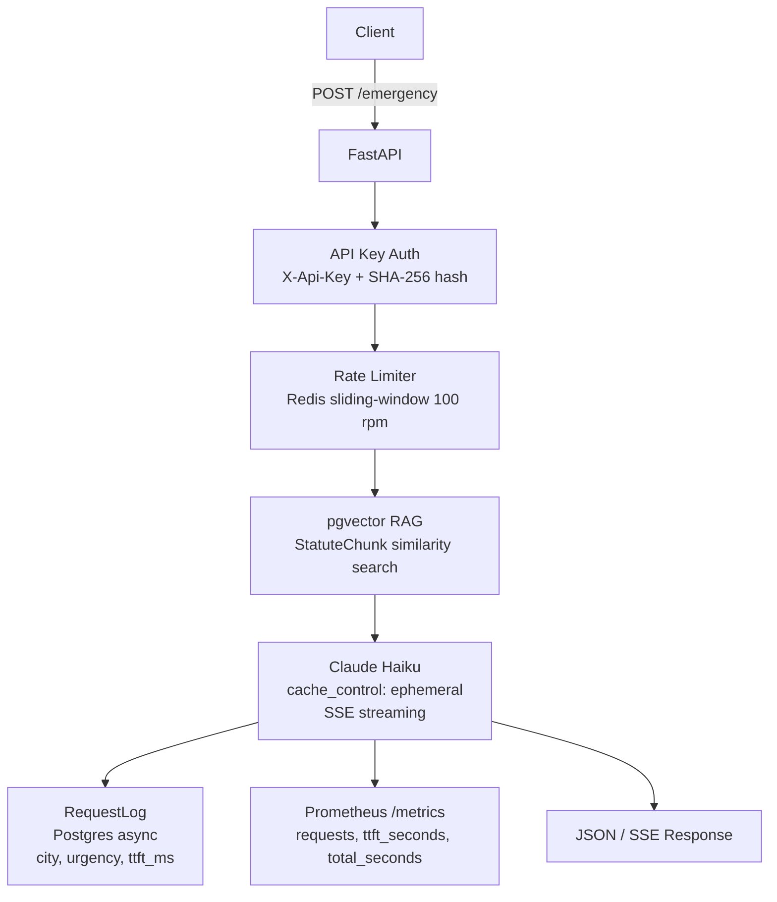

# emergency-ai

[](https://github.com/CasterlyGit/emergency-ai/actions/workflows/ci.yml)
[](LICENSE)
[](pyproject.toml)

**Jurisdiction-aware emergency guidance API: FastAPI + Postgres + pgvector + Redis + Prometheus, deployed on Fly.io (sjc), streaming structured JSON from Claude Haiku with prompt caching that drives cached TTFT under 200 ms.**

**Status:** v0.2 — multi-tenant API live on Fly.io, 6-city RAG knowledge base, Prometheus `/metrics` endpoint, CI green on Python 3.11 + 3.12.

**[Live demo →](https://casterlygit.github.io/emergency-ai/)** — pick a city, trigger a scenario, watch the streamed structured response with real TTFT and cache-hit indicator.

---

## Why this exists

Most "AI for safety" demos are repackaged chatbots. Real emergencies need three things a chatbot fails at:

1. **Speed.** A frozen 4-second model call is useless when someone is choking. Target: first action visible in **< 800 ms TTFT**, full structured response **< 2 s**.
2. **Jurisdiction.** What you should *do* in an emergency depends on where you are. The Good Samaritan law in California differs from New York. Drug amnesty in some jurisdictions changes whether you say *"opioid"* on the phone. The model needs grounded local context, not vibes.
3. **Discipline.** A wall of text wastes critical seconds. The output is a strict schema: urgency, ordered actions, who to call, what to avoid, time-to-act.

This service is the inference layer. Trigger surface (long-press button, Action Button on iOS, Android SOS) is a thin client that posts to `/emergency`.

---

## Architecture



**Prompt-caching.** Each city's law/cultural context is a multi-KB markdown blob sent as a `cache_control: ephemeral` block in the system prompt. First request to a city: full read (~600 ms TTFT). Subsequent requests within the 5-minute TTL: cached target **< 200 ms TTFT**. For a metro serving repeat traffic, the goal is ≥ 90% cache hit rate.

**Streaming structured output.** We don't wait for the full JSON. The CLI client renders fields as they arrive — `urgency` first, then the action list line-by-line. The user starts reacting before the model is done generating.

**No tool calls in the hot path.** Tools add round-trips. Everything the model needs is in the cached system prompt.

---

## Observability

Four Prometheus metrics exported at `GET /metrics`:

| Metric | Type | Labels |
|---|---|---|
| `emergency_requests_total` | Counter | `city`, `urgency`, `status` |
| `emergency_ttft_seconds` | Histogram | — |
| `emergency_total_seconds` | Histogram | — |
| `cache_hits_total` | Counter | `city` |

Histogram buckets: 100 ms, 250 ms, 500 ms, 800 ms, 1 s, 1.5 s, 2 s, 5 s — sized for the latency budget.

Structured log line per request: `request_id`, `city`, `urgency`, `ttft_ms`, `total_ms`, `mock`. Raw situation string is never logged.

---

## Latency budget

| Phase | Target | Notes |
|---|---|---|
| Network (mobile → server) | < 150 ms | edge deploy, persistent connection |
| Cache lookup + LLM TTFT | < 600 ms first req · < 200 ms cached | Haiku + prompt caching |
| First action visible to user | < 800 ms | streamed; `urgency` + first action first |
| Full structured response | < 2 s | end of stream |

These are design targets derived from the requirements doc. The CLI latency banner (`TTFT: 312 ms · total: 1.4 s · cache_hit: yes`) reports real numbers per request. Run `k6 run scripts/load_test.js` against the live URL to measure your own numbers; the k6 thresholds enforce p95 < 2500 ms and error rate < 1%.

---

## Project layout

```
src/emergency_ai/
├── core/
│   ├── schema.py       # pydantic models — EmergencyRequest, EmergencyResponse
│   ├── cities.py       # city context loader (filesystem → cached prompt blocks)
│   ├── client.py       # Anthropic client wrapper: streaming + caching + parsing
│   └── prompts.py      # system prompt template
├── api/
│   ├── server.py       # FastAPI app
│   ├── metrics.py      # Prometheus counter/histogram definitions + /metrics route
│   └── middleware.py   # API key auth + Redis rate limiting
├── cli/
│   └── main.py         # `emergency "..." --city "..."` demo client
├── db/
│   ├── models.py       # SQLAlchemy models: APIKey, RequestLog, StatuteChunk
│   └── session.py      # async Postgres session factory
├── rag/
│   ├── embed.py        # sentence-transformers embedding
│   ├── ingest.py       # city .md → pgvector upsert
│   └── search.py       # similarity search
└── cities/             # bundled city law context (one .md per city)
    ├── new-york.md
    ├── san-francisco.md
    ├── london.md
    ├── tokyo.md
    ├── mumbai.md
    └── bangalore.md

tests/                  # pytest — schema, cities loader, mocked client, SSE streaming
scripts/
├── load_test.js        # k6 load test (ramp to 50 VUs, p95 threshold 2.5 s)
└── smoke.sh            # quick smoke check against a running server
.flow/init/             # SDD pipeline artifacts (REQUIREMENTS, DESIGN, INTEGRATION)
```

---

## Quickstart

```bash
# 1. Install (one-time)
python3.12 -m venv .venv
source .venv/bin/activate
pip install -e ".[dev]"

# 2. Set your API key
export ANTHROPIC_API_KEY=sk-ant-...

# 3. Try the CLI
emergency "person collapsed on the platform, not breathing" --city "New York"

# 4. Or run the HTTP server
emergency-server   # listens on :8080
curl -N -X POST http://localhost:8080/emergency \
  -H 'content-type: application/json' \
  -d '{"situation":"smoke from kitchen, kids in apartment","city":"London"}'
```

The CLI prints a live latency banner (`TTFT: 312 ms · total: 1.4 s · cache_hit: yes`) so you can see the cache effect in real time.

---

## Running locally with Docker

```bash
cp .env.example .env
# edit .env — add your ANTHROPIC_API_KEY
docker compose up -d
python -m emergency_ai.rag.ingest  # optional: seed pgvector RAG
curl -X POST http://localhost:8080/emergency \
  -H "Content-Type: application/json" \
  -d '{"situation": "Person collapsed, not breathing", "city": "new-york"}'
```

---

## Deploy to Fly.io

```bash
fly launch --no-deploy        # first time only
fly secrets set ANTHROPIC_API_KEY=sk-ant-...
fly deploy
```

The app runs in `sjc` region (primary) with `auto_stop_machines = true`, `min_machines_running = 1`, and HTTPS enforced. VM: 512 MB RAM, 1 shared CPU, concurrency soft limit 150 / hard limit 200. See `fly.toml` for full config.

---

## Response schema

```json
{
  "urgency": "critical",
  "time_to_act_seconds": 30,
  "immediate_actions": [
    "Tilt head back, check breathing for 5 seconds",
    "If not breathing: begin chest compressions, 30 fast pushes",
    "Have someone else call 911 and put phone on speaker"
  ],
  "who_to_call": {
    "primary": "911",
    "poison_control": "1-800-222-1222"
  },
  "avoid": [
    "Don't move them unless they're in immediate danger",
    "Don't give water — they can't swallow safely"
  ],
  "jurisdictional_notes": "New York Good Samaritan Law (PHL §3000-a) protects bystanders giving good-faith aid from civil liability.",
  "confidence": 0.92,
  "disclaimer": "This is decision support, not medical or legal advice."
}
```

Response also includes a `_meta` envelope with `request_id`, `ttft_ms`, `total_ms`, and `city_slug`.

---

## Security posture

- **No situation logs.** Only `{city, urgency, latency, cache_hit}` persists. Raw situation strings are never stored.
- **No PII in prompts.** Client strips names/addresses before sending where reasonable.
- **Rate limiting.** Redis sliding-window per API key, 100 req/min default (configurable via `RATE_LIMIT_RPM`). Fails open if Redis is unavailable.
- **API key auth.** `X-Api-Key` header; stored as SHA-256 hash in Postgres. Bypassed by `EMERGENCY_AI_NO_AUTH=1` for local dev.
- **Disclaimer in every response.** `disclaimer` field rendered prominently in the client. This is decision support, not medical/legal advice.

---

## Adding a city

Drop a markdown file into `src/emergency_ai/cities/<slug>.md` following the structure of an existing city. Frontmatter fields: `display_name`, `country`, `emergency_numbers`. The loader hot-reloads on next request.

---

## Roadmap

- [ ] Fly.io deploy with live Prometheus scrape endpoint publicly accessible
- [ ] k6 benchmark results published in this README (real numbers against sjc)
- [ ] Mobile shell (iOS/Android long-press trigger) — service is the dependency; shell ships next
- [ ] Voice input — Whisper integration wired through CLI, not yet HTTP service
- [ ] More than 6 cities — coverage expansion is content work, not engineering
- [ ] Caller location from coordinates — accept `{lat, lon}`, reverse-geocode to city

---

## Companion repos

- [curby](https://github.com/CasterlyGit/curby) — voice → Claude reply in ~1 s; shares the streaming-first design philosophy
- [hand-signal](https://github.com/CasterlyGit/hand-signal) — hands-free confirmations; gesture layer that pairs with voice UIs
- [agent-harness](https://github.com/CasterlyGit/agent-harness) — agentic dev harness that generated this service's scaffolding

---

## License

MIT — see [LICENSE](LICENSE).
